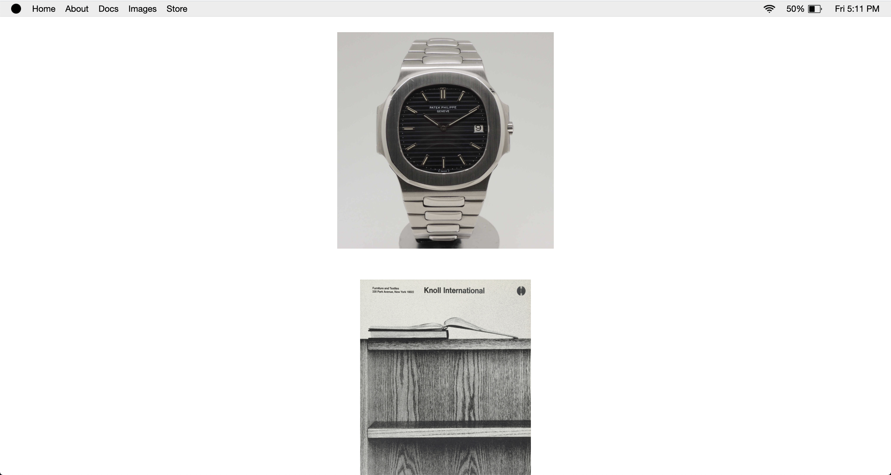

# About

This is a fully responsive personal blog website. It was made to look like you are looking on my computer. It doesn't get more personal then that! My design ethos is to keep things as simple as possible, so this blog only includes what it needs, nothing extra.

# Technologies

The technologies used to build this website include:

- HTML5
- CSS3
- SASS
- REACT
- REACT - ROUTER - DOM
- REDUX

# More info

This website includes 5 pages:

1. Home
2. About
3. Blog
4. Image mood board
5. Store for E-commerce

### Home

The home page features routes to both the image page and the blog page.

### About

About page includes a short sentence explaining the website. The about portion is dynamically rendered from a headless CMS called [Contentful](https://www.contentful.com).

### Blog

The blog component dynamically retrieves blog entries from the [Google Blogger](https://developers.google.com/blogger/docs/3.0/using) API. As I update entries within Google Blogger, they will appear on my personal blog website. The blog also includes an input search field to look for specific blog entries. It also includes a reverse button to change the order of input entries from earliest to latest and vice versa.

### Image mood board

The image section serves as a design mood board for referencing. It is rendered dynamically using the [Tumblr](https://www.tumblr.com/docs/en/api/v2) API.

### Store for E-commerce

The store is not available yet until products are decided on.

# Website Images

Homepage:

Blog: 

Images: 

Mobile responsive:

{:height="auto" width="300"}

Mobile responsive navigation dropdown: 

